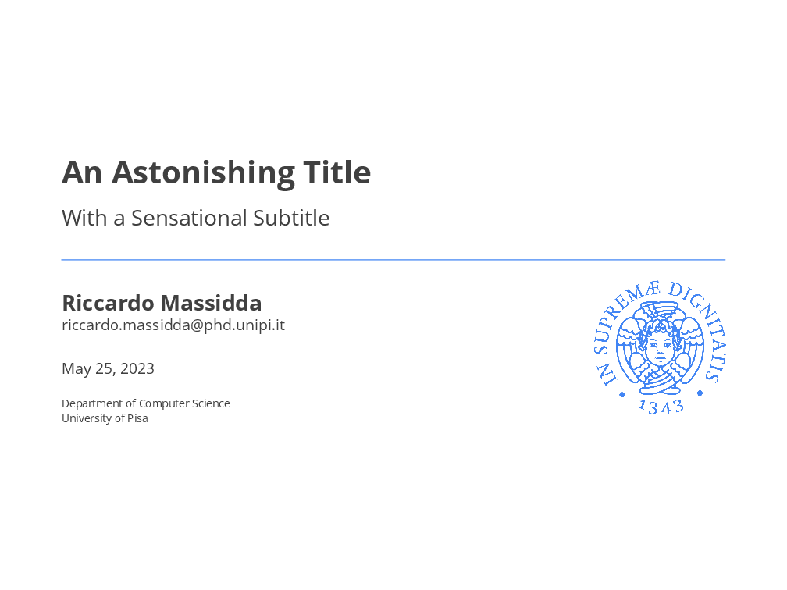
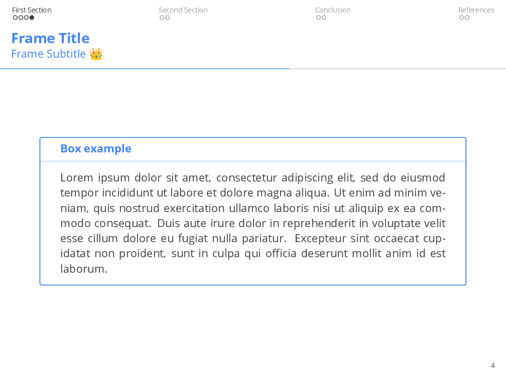
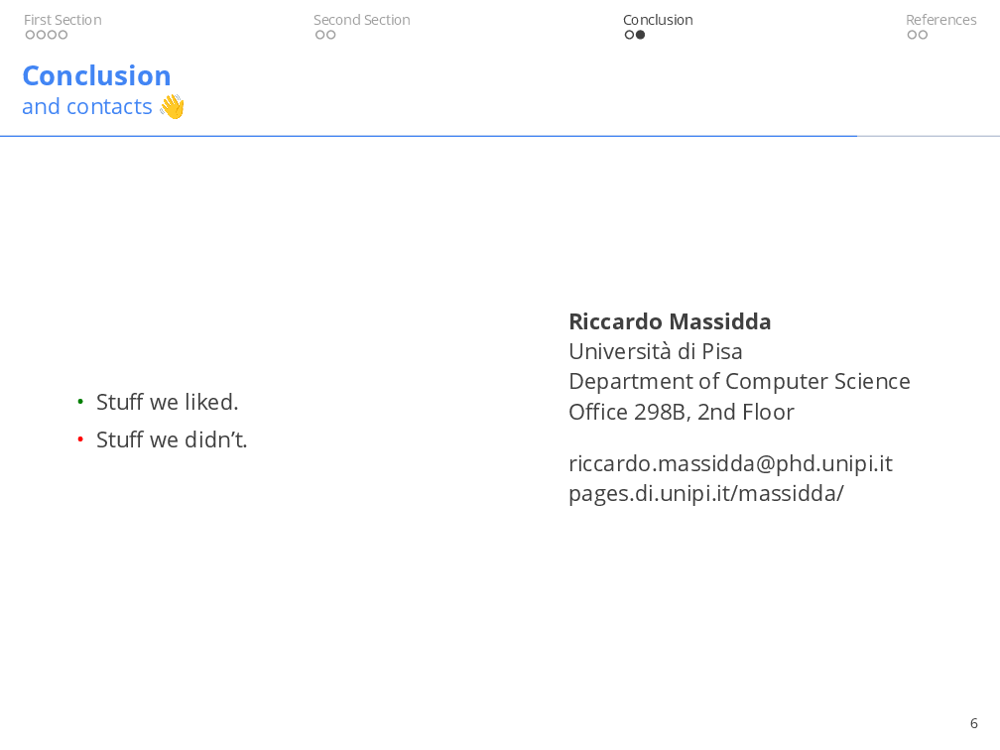

# Pisa - Beamer Template

  

A template for presentations given by members of the University of Pisa based on the Metropolis template.

Just compile with the `latexmk` command.

## Screenshots

  
  
  

## Credits

Original template shamelessly stolen from [Federica](https://www.linkedin.com/in/federica-di-pasquale-abb9a9149/).
